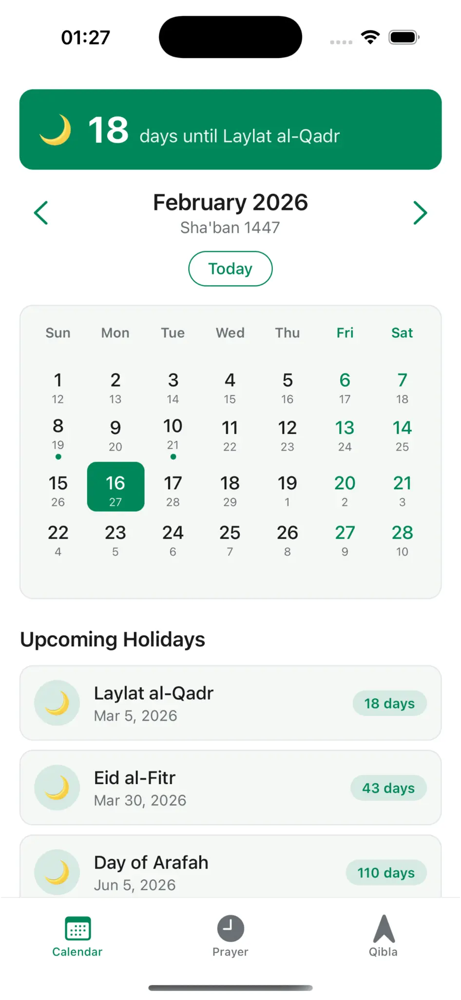
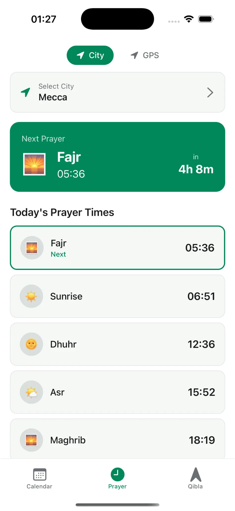
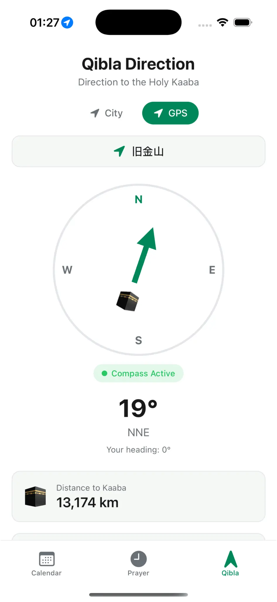

> # دعم تطبيق الصلاة الإسلامي
> 
> تطبيق جوال متطور وبديهي مصمم لربط حياتك اليومية بالتزاماتك الروحية بسلاسة. من خلال تقديم عرض تقويم مزدوج شامل، يضمن التطبيق إمكانية عرض التواريخ الميلادية والهجرية جنبًا إلى جنب بوضوح وسهولة لا مثيل لهما. لا تفوت لحظة من العبادة مع أوقات الصلاة عالية الدقة، والتي تستخدم حسابات متقدمة تعتمد على نظام تحديد المواقع العالمي (GPS) لتوفير توقيتات دقيقة مصممة خصيصًا لموقعك الجغرافي الدقيق. أصبح العثور على الاتجاه المقدس أمرًا سهلاً بفضل بوصلة القبلة المدمجة، مما يتيح لك تحديد موقع مكة من أي مكان في العالم. ابق على اطلاع على الأعياد الإسلامية الهامة من خلال التتبع التلقائي والعد التنازلي المفيد. خلال الشهر الفضيل، يقوم وضع رمضان بتنشيط ميزات متخصصة لتعزيز تجربة الصيام. تم تصميم التطبيق لجمهور عالمي، ويتميز بدعم ثنائي اللغة بالكامل باللغتين الإنجليزية والعربية، بما في ذلك تخطيط RTL أصلي للقراءة الطبيعية. كل هذا مغلف في واجهة iOS أصلية جميلة تدعم الوضع المظلم بالكامل لإحساس عصري متميز حقًا.
> 
> ## لقطات شاشة
> 
> | التقويم | أوقات الصلاة | اتجاه القبلة |
> | :---: | :---: | :---: |
> |  |  |  |
